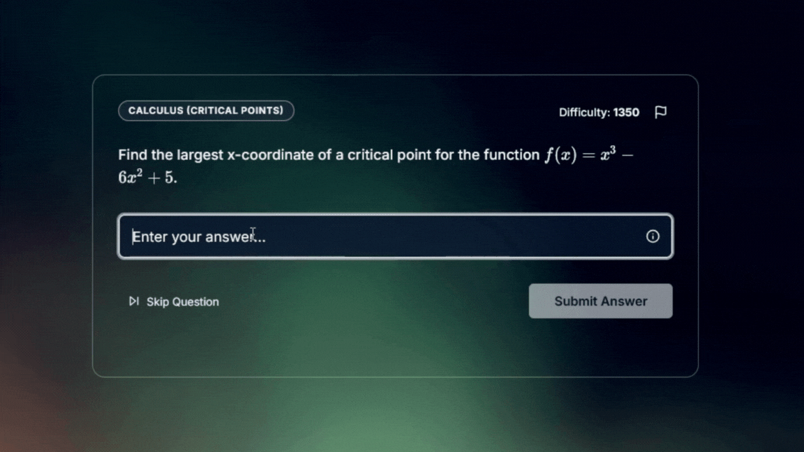
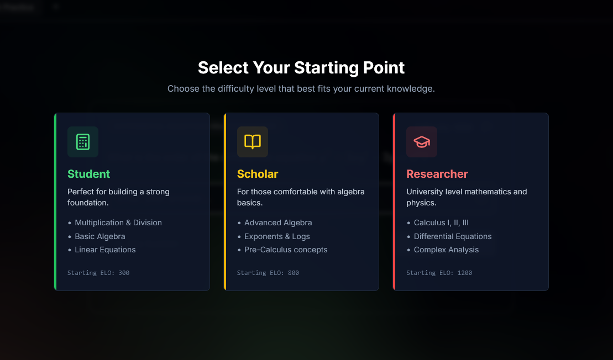
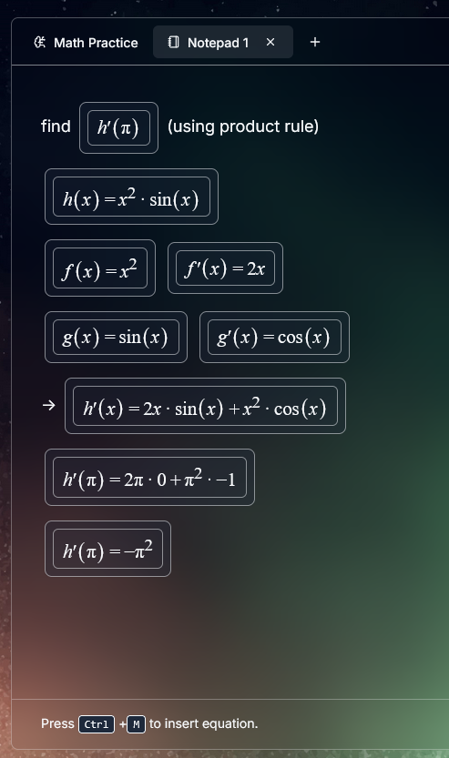
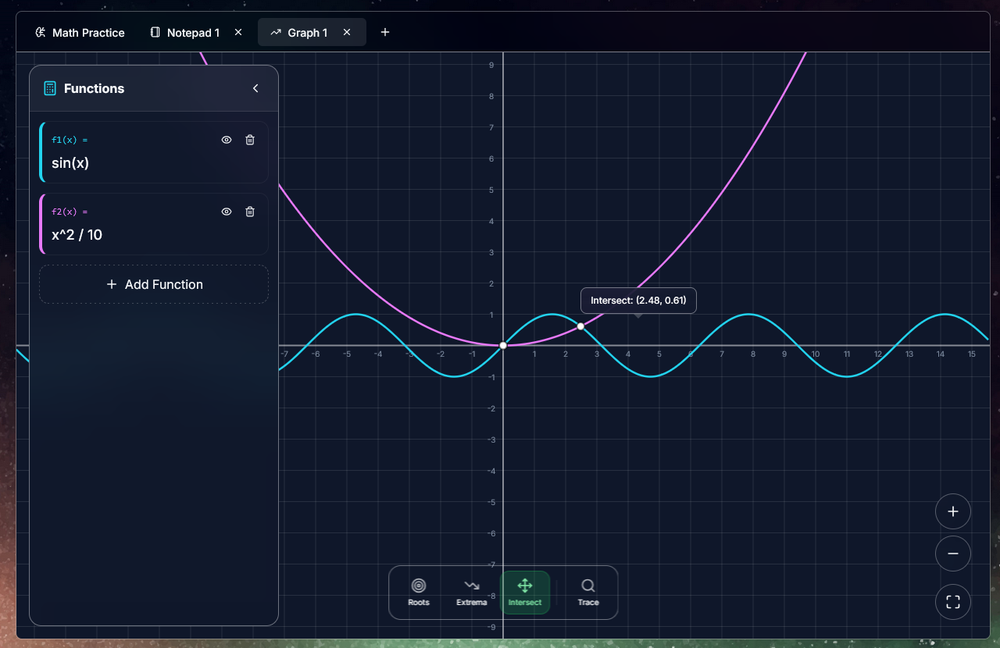

# 🧮 EloMath

An adaptive learning platform that matches problems to your skill level using an ELO rating system.

## Features

- **Adaptive Difficulty** - Problems adjust to your skill level
- **Math & Physics** - Calculus, Linear Algebra, Quantum Mechanics, and more
- **CAS Notepad** - Built-in symbolic math (derivatives, integrals, solving equations)
- **Graphing Tool** - Interactive function visualization with roots & extrema detection

## How It Works

Answer correctly → gain ELO → harder problems  
Answer incorrectly → lose ELO → easier problems

New users get to choose their starting skill level.

  

## Workspace

  
  

Use the CAS notepad and graphing tool while practicing.

Change between light and dark themes with the toggle in the top right.

